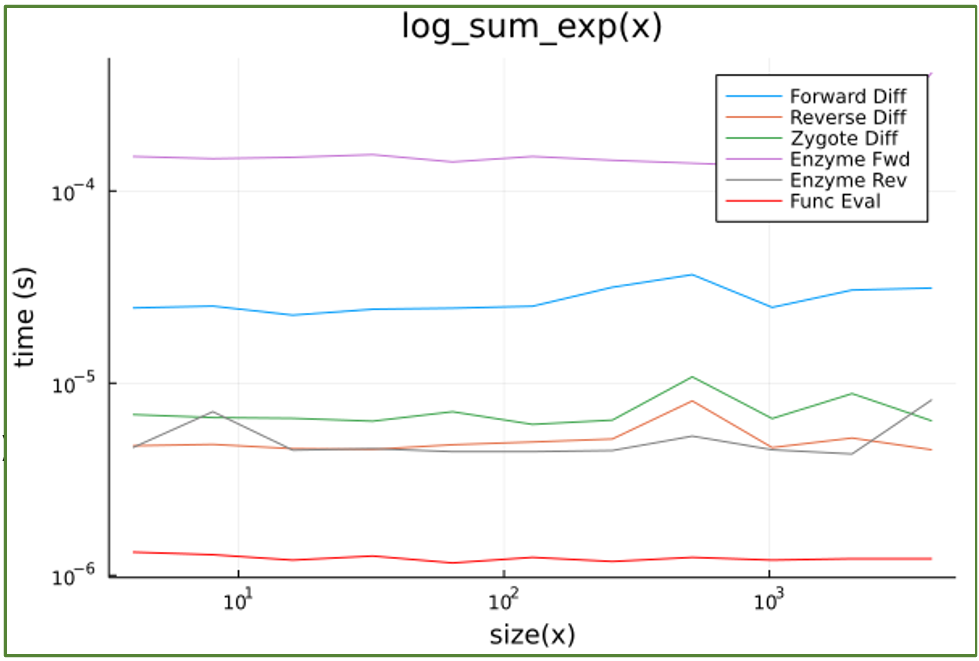
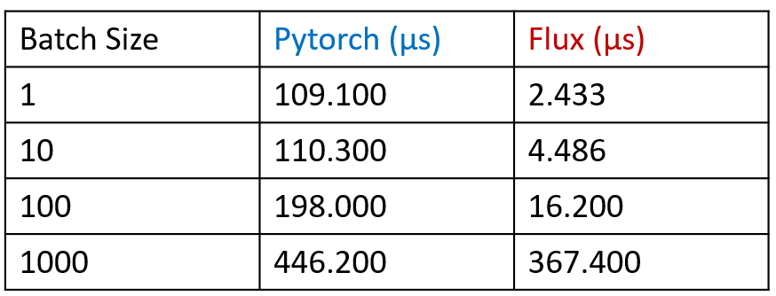

# DSC 291 Project : Numerical Linear Algebra

## Group 3 : Libraries and Tools : Julia and Python

## Members
*   Huning Chen (huc006@ucsd.edu)
*   Roshan Karande (rskarande@ucsd.edu)

## Repository Structure

```powershell
├───autodiff
├───machine_learning
├───optimization
└───other
```

### Repo Description:
-   autodiff - Code related to automatic differentiation
-   machine learning - Code related to machine learning libraries
-   optimization - Code related to optimization libraries


# Running the Code

In order to run the code one would have to install Julia and Python and also the libraries that are listed below - 

# Third Party Modules
- pyomo (Python Optimization)
- cvxpy (Python Convex Optimization)
- JuMP (Julia Optimization)
- Convex.jl (Julia Convex Optimization)
- FluxML(Julia - Machine Learning)
- SimpleChains(Julia - Machine Learning)
- Pytorch(Python - Machine Learning)
- Pytorch Autograd (Python - Automatic Differentiation)
- Jax (Python - Automatic Differentiation)
- ForwardDiff (Julia - Automatic Differentiation)
- ReverseDiff (Julia - Automatic Differentiation)
- Zygote (Julia - Automatic Differentiation)
- Enzyme(Julia - Automatic Differentiation)

# Results
- autodiff/benchmarks.jl


- ml/machine_learning/pytorch_flux_basic1.jl

